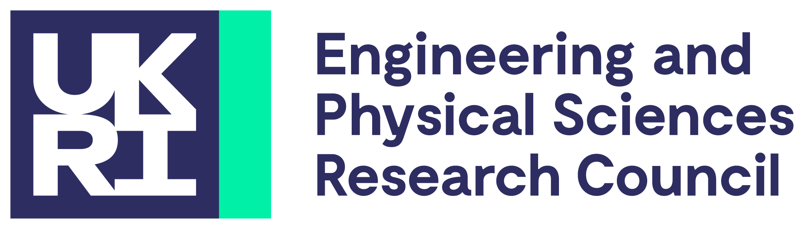

<p align="center">
  
  &nbsp;&nbsp;&nbsp;&nbsp;
  
</p>

# PAIR: Property Asset & Retrofit Insight

This repository contains the client website for the PAIR (Property Asset & Retrofit Insight) project.

Developed and All Rights Reserved by [University of Huddersfield](https://hud.ac.uk) &copy; 2026, under the leadership of [Dr. Shamaila Iram](mailto:s.iram@hud.ac.uk), Senior Lecturer at the University of Huddersfield. Funded by Impact Acceleration Accounts under UKRI.

## Tech stack

- [Next.js](https://nextjs.org) (App Router)
- [React](https://react.dev)
- [TypeScript](https://www.typescriptlang.org)
- [Tailwind CSS](https://tailwindcss.com)

## Getting started

Install dependencies and start the development server:

```bash
npm install
npm run dev
```

Open [http://localhost:3000](http://localhost:3000) to view the site.

Other available scripts:

```bash
npm run build   # production build
npm run start   # serve the production build
npm run lint    # run eslint
```

## Content

### Case studies

Case studies are plain data, not a CMS. Everything lives in [lib/case-studies.ts](lib/case-studies.ts) as an array of `CaseStudy` objects:

```ts
{
  slug: "your-slug-here",       // becomes /case-studies/your-slug-here
  eyebrow: "Category label",     // short tag shown above the title
  title: "The page title",
  dek: "One sentence summary shown on the index card and the detail page.",
  cover: "/images/screenshots/some-image.png",
  coverAlt: "Description for screen readers",
  sections: [
    { heading: "A short heading", body: "A few honest sentences." },
  ],
  showLadder: false,             // optional: shows the EPC ladder graphic at the end
}
```

To add a case study, add an entry to that array. Nothing else needs to change: [app/case-studies/page.tsx](app/case-studies/page.tsx) lists every entry automatically, and [app/case-studies/[slug]/page.tsx](app/case-studies/%5Bslug%5D/page.tsx) generates a static route for each `slug` via `generateStaticParams`. Unknown slugs 404 (`dynamicParams = false`), which is required for the static export.

One rule worth keeping: do not invent specific results, statistics, or quotes and attribute them to a real partner. Write what is actually true (the project context, what the pilot is testing) rather than a polished outcome that has not happened yet. If a case study only has honest, general things to say, that is fine, say those.

## Deployment

Pushes to `main` are automatically built and deployed to GitHub Pages via the workflow in [.github/workflows/nextjs.yml](.github/workflows/nextjs.yml).

## Contributors

The following people and organisations contributed to the PAIR project:

<table>
  <tr>
    <td align="center">
      <a href="mailto:s.iram@hud.ac.uk">
        <circle cx='60' cy='60' r='60' fill='%23E5E7EB'/><circle cx='60' cy='45' r='22' fill='%239CA3AF'/><path d='M60 70 C30 70 15 95 15 120 L105 120 C105 95 90 70 60 70 Z' fill='%239CA3AF'/></svg>" width="120" height="120" alt="Dr. Shamaila Iram"><br>
        <sub><b>Dr. Shamaila Iram</b></sub>
      </a><br>
      PI & Senior Lecturer
    </td>
    <td align="center">
      <a href="https://github.com/mr-mallik">
        <br>
        <sub><b>Gulger Mallik</b></sub>
      </a><br>
      Researcher & Lead Developer
    </td>
    <td align="center">
      <a href="https://github.com/Atharfarid">
        <br>
        <sub><b>Dr. Athar Farid</b></sub>
      </a><br>
      Researcher & PhD Student
    </td>
    <td align="center">
      <br>
      <sub><b>Together Housing Group</b></sub><br>
      Associated Partner
    </td>
  </tr>
</table>

## License

All rights reserved. See [LICENCE](LICENCE) for details.
